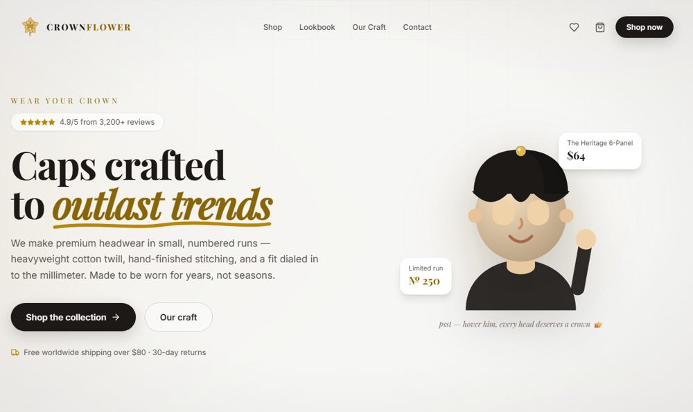

# CROWNFLOWER

<!-- badges -->
[](LICENSE) [](https://github.com/YuraItDeveloper14/CrownFlower/commits)

<!-- preview -->
<p align="center">
  
</p>

Storefront for a premium cap brand — built as a full shopping flow, not a landing page.

**Live:** [crownflower.vercel.app](https://crownflower.vercel.app)

## What is in it

- Catalogue with product pages
- Cart and wishlist that survive a reload
- Lookbook, FAQ, contact and legal pages
- 3D hero built with Spline and Three.js
- Ships either as a web app or as a desktop build through Electron

## Stack

React 18 · Vite · React Router · Framer Motion · Three.js · Spline · Electron

## Running it

```bash
npm install
npm run dev          # web, on http://localhost:5173
npm run electron:dev # desktop window
```

Build:

```bash
npm run build           # web bundle
npm run electron:build  # Windows desktop build
```

## Layout

```
src/
  pages/       Home, Shop, Product, Cart, Wishlist, Lookbook, About, Faq, Contact, Legal
  components/  shared UI
  context/     cart and wishlist state
  data/        product catalogue
electron/      desktop shell
```

## Licence

MIT — see [LICENSE](LICENSE).
